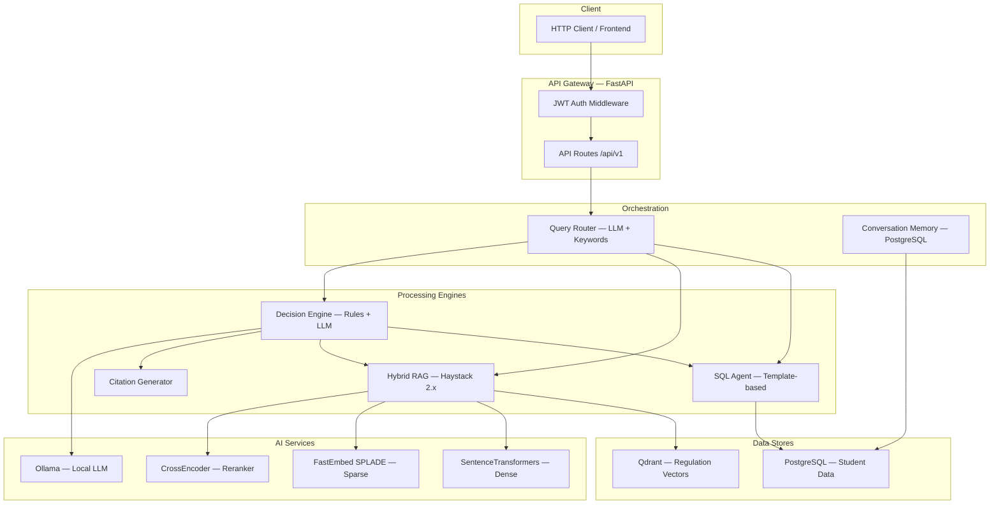

# Decision-Making Academic Assistant 🎓

A production-style intelligent academic assistant for universities that combines **Hybrid RAG**, **SQL querying**, and **policy-based decision-making** to answer complex academic questions.

> **This is NOT a simple PDF chatbot.** It reasons over regulations, inspects student data, applies policy conditions, and generates justified decisions with citations.

---

## Architecture



## Features

| Feature | Description |
|---------|-------------|
| 🔀 **Query Routing** | LLM-based classification into SQL, RAG, or Hybrid queries |
| 🗃️ **SQL Agent** | Safe, template-based student data access (no raw SQL generation) |
| 📚 **Hybrid RAG** | Dense + Sparse retrieval with cross-encoder reranking |
| 🧠 **Decision Engine** | Deterministic policy checks + LLM reasoning |
| 📎 **Citation Generator** | Source attribution with article/section references |
| 💬 **Conversation Memory** | Multi-turn context via PostgreSQL-backed sessions |
| 🔐 **JWT Authentication** | Role-based access (admin, student, advisor) |
| 📊 **Admin Dashboard API** | System stats, student management, data seeding |

## Tech Stack

- **Framework:** FastAPI (async)
- **Orchestration:** Haystack 2.x
- **Vector DB:** Qdrant (hybrid dense+sparse)
- **Relational DB:** PostgreSQL 16
- **Local LLM:** Ollama (llama3.1:8b)
- **Embeddings:** SentenceTransformers (dense) + FastEmbed SPLADE (sparse)
- **Reranking:** CrossEncoder (ms-marco-MiniLM)
- **Auth:** JWT + bcrypt
- **Containerization:** Docker Compose

## Quick Start

### 1. Clone & Configure

```bash
cp .env.example .env
# Edit .env with your settings
```

### 2. Start Infrastructure

```bash
docker-compose up -d postgres qdrant ollama
```

### 3. Pull the Ollama Model

```bash
docker exec academic_ollama ollama pull llama3.1:8b
```

### 4. Install Dependencies

```bash
python -m venv venv
source venv/bin/activate    # or venv\Scripts\activate on Windows
pip install -r requirements.txt
```

### 5. Initialize Database & Seed Data

```bash
python -m app.db.seed
```

### 6. Ingest Regulation Documents

```bash
python -m app.rag.ingestion
```

### 7. Start the Application

```bash
uvicorn app.main:app --reload --host 0.0.0.0 --port 8000
```

### 8. Access the API

- **Swagger Docs:** http://localhost:8000/docs
- **ReDoc:** http://localhost:8000/redoc
- **Health Check:** http://localhost:8000/health

## API Reference

### Authentication

```bash
# Login (get JWT token)
curl -X POST http://localhost:8000/api/v1/auth/login \
  -H "Content-Type: application/json" \
  -d '{"username": "khalid", "password": "student123"}'
```

Default accounts after seeding:

| Username | Password | Role | Student |
|----------|----------|------|---------|
| admin | admin123 | admin | — |
| khalid | student123 | student | Khalid Al-Mansoor (GPA: 3.65) |
| noor | student123 | student | Noor Abdullah (GPA: 3.20) |
| tariq | student123 | student | Tariq Hassan (GPA: 1.85, probation) |
| hassan | student123 | student | Hassan Darwish (GPA: 2.90) |
| lina | student123 | student | Lina Saeed (GPA: 3.80, freshman) |
| advisor | advisor123 | advisor | Dr. Ahmad Al-Rashid |

### Ask a Question

```bash
# SQL query — "What is my GPA?"
curl -X POST http://localhost:8000/api/v1/ask \
  -H "Authorization: Bearer <token>" \
  -H "Content-Type: application/json" \
  -d '{"question": "What is my GPA?"}'

# RAG query — "What is the withdrawal policy?"
curl -X POST http://localhost:8000/api/v1/ask \
  -H "Authorization: Bearer <token>" \
  -d '{"question": "What is the withdrawal policy?"}'

# Hybrid decision — "Can I register for Internship 2?"
curl -X POST http://localhost:8000/api/v1/ask \
  -H "Authorization: Bearer <token>" \
  -d '{"question": "Can I register for Internship 2?"}'
```

### Response Format

```json
{
  "answer": "Based on your academic record, you ARE eligible to register for Internship 2...",
  "decision": "APPROVED",
  "reasoning": [
    "✅ Student status is active.",
    "✅ GPA is 2.900 (≥ 2.0 required).",
    "✅ 95 completed credits (≥ 90 required).",
    "✅ Internship 1 completed with grade B+."
  ],
  "student_data": {
    "full_name": "Hassan Darwish",
    "gpa": 2.9,
    "total_credits": 95
  },
  "citations": [
    {
      "source": "Internship Policy",
      "section": "Section 13.2",
      "text": "To register for Internship 2, a student must have completed a minimum of 90 credit hours..."
    }
  ],
  "confidence": 0.92,
  "query_type": "HYBRID"
}
```

### Admin Endpoints

```bash
# System stats (admin only)
curl http://localhost:8000/api/v1/admin/stats \
  -H "Authorization: Bearer <admin_token>"

# Seed database
curl -X POST http://localhost:8000/api/v1/admin/seed \
  -H "Authorization: Bearer <admin_token>"

# Trigger document ingestion
curl -X POST http://localhost:8000/api/v1/admin/ingest \
  -H "Authorization: Bearer <admin_token>"
```

## Project Structure

```
├── docker-compose.yml          # Infrastructure services
├── Dockerfile                  # Multi-stage production build
├── requirements.txt            # Python dependencies
├── .env.example                # Environment variables template
├── alembic.ini                 # Database migration config
├── app/
│   ├── main.py                 # FastAPI app factory
│   ├── config.py               # Pydantic settings
│   ├── dependencies.py         # Dependency injection
│   ├── auth/                   # JWT authentication
│   │   ├── service.py          # Password + token logic
│   │   ├── middleware.py       # Bearer token + role checks
│   │   └── router.py           # /auth/* endpoints
│   ├── db/                     # Database layer
│   │   ├── database.py         # Async SQLAlchemy engine
│   │   ├── models.py           # ORM models
│   │   ├── schemas.py          # Pydantic schemas
│   │   └── seed.py             # Sample data
│   ├── sql_agent/              # SQL query agent
│   │   ├── queries.py          # Pre-built queries
│   │   └── agent.py            # Query dispatcher
│   ├── rag/                    # Hybrid RAG engine
│   │   ├── document_store.py   # Qdrant config
│   │   ├── ingestion.py        # Haystack ingestion pipeline
│   │   ├── retrieval.py        # Haystack retrieval pipeline
│   │   └── embedders.py        # Model configuration
│   ├── router/                 # Query classification
│   │   └── query_router.py     # LLM + keyword routing
│   ├── decision/               # Decision engine
│   │   ├── engine.py           # Core orchestrator
│   │   ├── rules.py            # Deterministic policy checks
│   │   └── prompts.py          # LLM prompt templates
│   ├── citation/               # Citation management
│   │   └── generator.py        # Source extraction
│   ├── memory/                 # Conversation memory
│   │   └── conversation.py     # Session-based history
│   ├── api/                    # API endpoints
│   │   ├── assistant.py        # POST /ask
│   │   ├── documents.py        # Document management
│   │   └── router.py           # Route aggregator
│   └── admin/                  # Admin APIs
│       └── router.py           # Stats, management
├── data/regulations/           # Sample regulation documents
├── sql/schema.sql              # Database schema
└── tests/                      # Test suite
```

## Query Routing Examples

| Question | Route | Why |
|----------|-------|-----|
| "What is my GPA?" | SQL_ONLY | Pure data lookup |
| "Show my completed courses" | SQL_ONLY | Database query |
| "What is the withdrawal policy?" | RAG_ONLY | Regulation lookup |
| "How does academic probation work?" | RAG_ONLY | Policy explanation |
| "Can I register for Internship 2?" | HYBRID | Needs data + policy |
| "Why am I on probation?" | HYBRID | Needs standing + rules |
| "Can I graduate?" | HYBRID | Needs progress + requirements |

## Configuration

All settings are configured via environment variables. See `.env.example` for the complete list.

Key settings:

| Variable | Default | Description |
|----------|---------|-------------|
| `OLLAMA_MODEL` | llama3.1:8b | Local LLM model |
| `DENSE_EMBEDDING_MODEL` | all-MiniLM-L6-v2 | Dense embedding model |
| `RAG_TOP_K` | 10 | Retrieval candidates |
| `RAG_RERANK_TOP_K` | 5 | Final reranked results |
| `JWT_EXPIRATION_MINUTES` | 480 | Token lifetime |

## License

MIT
